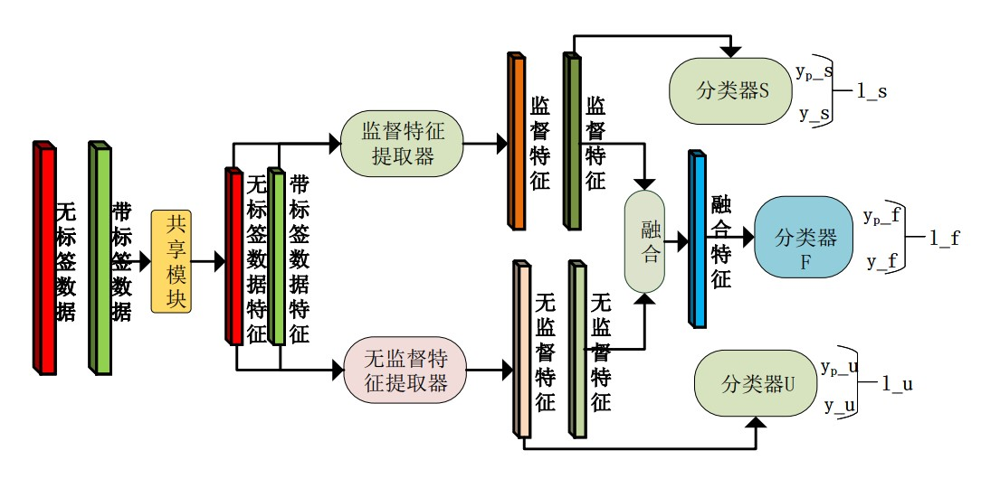

# 中文版
# Unsupervised Knowledge Learning(UKL) for Hyperspectral image classification(Tensorflow-Code)


 这个仓库是UKL的tensorflow版本代码。

 我们提出了一个结合无监督知识学习的半监督学习框架，通过无监督知识学习来提升监督任务的分类性能，通过聚类算法引入样本相似性，然后通过卷积神经网络来强化无监督算法学习到的知识，并将之与监督任务结合，学习融合了监督和无监督知识的分类特征，我们的算法大大提升了高光谱图像分类任务的性能。

整体框架图如下图所示：




我们通过K-means算法将无标签样本聚成K类，每个样本可以通过聚类算法得到聚类类别（为标签信息），而后通过监督学习的方式进行特征提取。

每个训练的batch都包含一部分真实带标签样本和有聚类伪标签的无标签样本。

损失函数通过交叉熵计算，我们使用直接相加的方式得到总损失。

该算法在ubuntu16.04系统，python3.5的环境下实现，python需要的环境如下:

```
numpy 1.16.2
tensorflow-gpu  1.10.0
scipy 1.3.1
sklearn 0.20.2
matplotlib 2.0.3
```

高光谱数据集可以在这个网址下载 http://www.ehu.eus/ccwintco/index.php?title=Hyperspectral_Remote_Sensing_Scenes. 


我们使用了 Indian Pines, University of PaviaU and Salinas三个数据集来评估我们的算法，实验显示我们的算法有惊人的结果。由于高光谱图像分类领域各个数据集实验设置往往不同，会有按百分比来划分训练集和测试集，或者通过每类选取固定数目的样本来划分训练集和测试集，或者取不同大小的像素块作为训练样本对实验结果影响也很大(通常有的算法会取大小为十几二十几的像素块)，我们的算法在当前（202003）可以达到state-of-the-art。

在固定每类训练样本为200个时（如果少于200取15个样本），三个数据集上我们的算法都能达到近乎100%的分类准确率（OA）。

在每类取1个样本作为训练集，其余用作测试时，在Indian Pines可以达到74.58%的准确率, PaviaU可以达到82.83%的准确率， 在Salinas可以达到80.89%的准确率。 

在每类取5个样本作为训练集，其余用作测试时，在Indian Pines可以达到89.81%的准确率, PaviaU可以达到95.87%的准确率， 在Salinas可以达到91.65%的准确率。 

在每类取10个样本作为训练集，其余用作测试时，在Indian Pines可以达到94.34%的准确率, PaviaU可以达到99.52%的准确率， 在Salinas可以达到96.36%的准确率。 


可以通过使用更深的共享特征提取模块或者使用更大的cube（我们使用了大小为3的cube，你可以使用5或者7）作为训练集来提升分类任务的性能。

main.py中包含了默认的实验超参数设置，可以通过改变数据集路径来评估不同的数据集，注意对于不同的数据集（由于光谱维度不相同）和cube（由于空间维卷积大小不同），模型整体的网络结构稍有不同。

这里将一次训练的结果呈现出来，使用PaviaU数据集，每类随机10个样本作为训练集，训练集像素块大小为3*3。

可以参考 https://ieeexplore.ieee.org/document/8898323 了解本任务的前续工作, 或者参考"原理.pdf".
